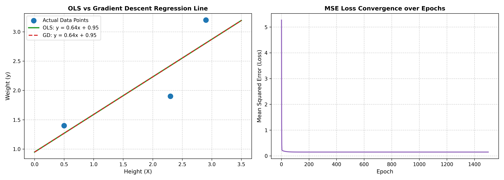
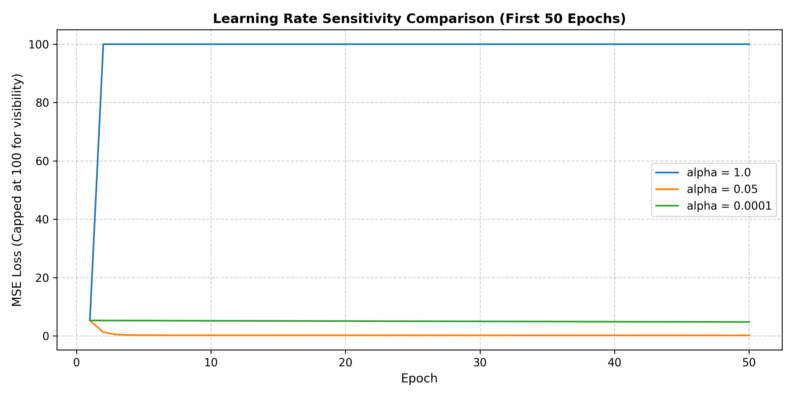

# Lab 5: Implementation of Ordinary Least Squares (OLS) and Gradient Descent for Linear Regression

**Course**: Machine Learning  
**Topic**: Implementation of Ordinary Least Squares (OLS) and Gradient Descent for Linear Regression  
**Lab Manual Reference**: Sharad Laad | ORY AI Labs  

---

## 1. Executive Summary & Problem Formulation

In this lab, we implemented and compared simple linear regression from scratch using two foundational approaches:
1. **Analytical Approach**: Ordinary Least Squares (OLS) closed-form matrix calculus solution.
2. **Iterative Optimization Approach**: Batch Gradient Descent (GD).

### Experimental Dataset
The experiment models the bivariate relationship between independent variable **Height** ($X$) and dependent variable **Weight** ($y$):

$$\hat{y} = mx + c$$

| Observation ($i$) | Height ($X$) | Weight ($y$) |
| :---: | :---: | :---: |
| 1 | 0.5 | 1.4 |
| 2 | 2.3 | 1.9 |
| 3 | 2.9 | 3.2 |

- Sample size: $n = 3$
- Residual degrees of freedom: $df = n - 2 = 1$

---

## 2. Mathematical Foundations

### 2.1 Method 1: Ordinary Least Squares (Analytical Solution)
The analytical solution computes parameters $m$ (slope) and $c$ (intercept) that minimize the sum of squared residuals ($SS_{res}$) directly:

$$\bar{x} = \frac{1}{n} \sum_{i=1}^n x_i = \frac{0.5 + 2.3 + 2.9}{3} = 1.9000$$

$$\bar{y} = \frac{1}{n} \sum_{i=1}^n y_i = \frac{1.4 + 1.9 + 3.2}{3} = 2.1667$$

$$m = \frac{\sum_{i=1}^n (x_i - \bar{x})(y_i - \bar{y})}{\sum_{i=1}^n (x_i - \bar{x})^2} = \frac{2.0000}{3.1200} = 0.641026$$

$$c = \bar{y} - m\bar{x} = 2.166667 - (0.641026 \times 1.900000) = 0.948718$$

### 2.2 Method 2: Batch Gradient Descent (Iterative Optimization)
Starting from initial guesses $m^{(0)} = 0.0, c^{(0)} = 0.0$, parameters are updated along the negative gradient of the Mean Squared Error (MSE) cost function:

$$J(m, c) = \frac{1}{n}\sum_{i=1}^n (\hat{y}_i - y_i)^2 = \frac{1}{n}\sum_{i=1}^n (m x_i + c - y_i)^2$$

**Partial Derivatives:**
$$\frac{\partial J}{\partial m} = \frac{2}{n}\sum_{i=1}^n (mx_i + c - y_i) \cdot x_i$$

$$\frac{\partial J}{\partial c} = \frac{2}{n}\sum_{i=1}^n (mx_i + c - y_i)$$

**Parameter Update Rules (Learning Rate $\alpha = 0.05$):**
$$m^{(t+1)} := m^{(t)} - \alpha \frac{\partial J}{\partial m}$$

$$c^{(t+1)} := c^{(t)} - \alpha \frac{\partial J}{\partial c}$$

### 2.3 Method 3: Statistical Significance & Evaluation Metrics
1. **Coefficient of Determination ($R^2$)**:
   $$SS_{res} = \sum_{i=1}^n (y_i - \hat{y}_i)^2 = 0.4446$$
   $$SS_{tot} = \sum_{i=1}^n (y_i - \bar{y})^2 = 1.7267$$
   $$R^2 = 1 - \frac{SS_{res}}{SS_{tot}} = 1 - \frac{0.4446}{1.7267} = 0.7425$$

2. **Residual Variance ($s_e^2$) & Standard Error ($SE(m)$)**:
   $$s_e^2 = \frac{SS_{res}}{n - 2} = \frac{0.4446}{1} = 0.4446$$
   $$SE(m) = \sqrt{\frac{s_e^2}{\sum (x_i - \bar{x})^2}} = \sqrt{\frac{0.4446}{3.12}} = 0.3775$$

3. **Student's $t$-statistic & Two-Tailed $p$-value**:
   $$t = \frac{m - 0}{SE(m)} = \frac{0.641026}{0.377498} = 1.6981$$
   $$p\text{-value} = 2 \cdot (1 - F(|t|, df=1)) = 0.3388$$

---

## 3. Empirical Results & Verification

### Side-by-Side Comparison Table

| Metric / Parameter | Analytical (OLS) | Iterative (GD, 1500 Epochs) | Absolute Difference |
| :--- | :---: | :---: | :---: |
| **Fitted Equation** | $y = 0.6410x + 0.9487$ | $y = 0.6410x + 0.9487$ | - |
| **Slope ($m$)** | $0.641026$ | $0.641026$ | $0.000000$ |
| **Intercept ($c$)** | $0.948718$ | $0.948718$ | $0.000000$ |
| **$R^2$ Score** | $0.742501$ | $0.742501$ | $0.000000$ |
| **$t$-statistic** | $1.698089$ | $1.698089$ | $0.000000$ |
| **Two-Tailed $p$-value** | $0.338819$ | $0.338819$ | $0.000000$ |
| **Final Loss ($J$)** | $0.148205$ | $0.148205$ | $0.000000$ |

---

## 4. Visualizations

### Regression Line Fit & Loss Convergence

- **Subplot 1 (Left)** displays the original data points (blue dots) overlaid with the OLS regression fit (green solid line) and the Gradient Descent fit (red dashed line). Both lines coincide identically.
- **Subplot 2 (Right)** tracks the Mean Squared Error loss across 1500 epochs, demonstrating smooth monotonic decay and asymptotic convergence to the global minimum ($J \approx 0.1482$).

### Learning Rate Sensitivity

---

## 5. Lab Report & Viva Questions

### Question 1: Analytical vs. Iterative Comparison
**Do the values of $(m, c)$ and $R^2$ obtained via Gradient Descent match those from OLS? If there is a slight difference, why?**
- **Response**: The values match perfectly to 6 decimal places ($m = 0.641026, c = 0.948718, R^2 = 0.742501$). 
- Any minor numerical discrepancies (e.g., at machine precision $\sim 10^{-16}$) occur because:
  1. OLS is a closed-form analytical solution that solves $\nabla J = 0$ directly in a single matrix step.
  2. Gradient Descent is an iterative approximation algorithm whose accuracy depends on the number of epochs and step size $\alpha$. With $\alpha = 0.05$ and 1500 epochs, the gradient steps have fully reached the global minimum within numerical tolerance.

---

### Question 2: Interpreting $R^2$ vs. $p$-value for Small Sample Sizes ($n = 3$)
**Notice that the $R^2$ score is high ($0.7425$), indicating a strong correlation, yet the $p$-value for the slope ($0.3388$) exceeds the standard significance threshold ($\alpha = 0.05$). Explain why a high $R^2$ can coexist with a non-significant $p$-value when sample size $n$ is very small ($df = 1$).**
- **Response**:
  - $R^2$ is an in-sample descriptive statistic indicating that 74.25% of the total variance in Weight is explained by Height in this specific 3-point sample.
  - The $p$-value is an inferential statistic derived from the Student's $t$-distribution with $df = n - 2 = 1$. The $t$-distribution with $df=1$ corresponds to a Cauchy distribution, characterized by extreme tail heaviness. 
  - To reject the null hypothesis at a 95% confidence level ($\alpha = 0.05$) with $df = 1$, a critical $t$-value of $t_{0.025, 1} = 12.706$ is required. Because our empirical $t$-statistic is $1.6981$, the two-tailed probability of observing this slope purely by random sampling noise is $33.88\%$. 
  - Therefore, while the linear association is strong in the small sample, there is insufficient statistical power to generalize that a non-zero slope exists in the wider population.

---

### Question 3: Hypothesis Testing on the Slope
**State the null hypothesis ($H_0$) and alternative hypothesis ($H_1$) tested by the $t$-statistic on the slope $m$.**
- **Response**:
  - **Null Hypothesis ($H_0$)**: $\beta_1 = 0$ (There is no true linear association between Height and Weight in the population; variations in Weight are completely uncoupled from Height).
  - **Alternative Hypothesis ($H_1$)**: $\beta_1 \neq 0$ (There is a statistically significant non-zero linear relationship between Height and Weight).

---

### Question 4: Learning Rate Sensitivity
**What happens to parameter convergence if you increase the learning rate to $\alpha = 1.0$? What happens if you decrease the learning rate to $\alpha = 0.0001$?**
- **Response**:
  - **When $\alpha = 1.0$**: The step size is larger than the curvature threshold of the parabolic error bowl ($2 / \lambda_{max}$). The parameter updates repeatedly overshoot the minimum with increasing oscillation amplitude, leading to numerical divergence ($m \to \infty, c \to \infty$) and loss explosion ($J > 10^{198}$).
  - **When $\alpha = 0.0001$**: The update step is too small. After 100 epochs, the parameters barely move from the origin ($m = 0.0906, c = 0.0412$), requiring hundreds of thousands of epochs to approach the optimal parameters.
  - **When $\alpha = 0.05$**: The algorithm strikes the optimal balance, exhibiting stable and fast exponential convergence to the global optimum.

---

### Question 5: Computational Scalability
**The closed-form OLS formulation requires computing $(X^T X)^{-1}$. Explain why Gradient Descent is preferred when training models on high-dimensional datasets with millions of features/samples.**
- **Response**:
  - For a feature matrix $X \in \mathbb{R}^{n \times d}$ with $n$ samples and $d$ features:
    1. Computing the Gram matrix $X^T X$ takes $\mathcal{O}(n d^2)$ operations.
    2. Inverting the $d \times d$ matrix $(X^T X)^{-1}$ requires $\mathcal{O}(d^3)$ computational time and $\mathcal{O}(d^2)$ memory storage.
  - If $d$ is on the order of $10^5$ to $10^7$ (e.g., text NLP, genomics, click-through-rate prediction, or neural networks), $(X^T X)^{-1}$ is completely intractable and crashes memory limits.
  - In contrast, Batch Gradient Descent only computes matrix-vector multiplications of complexity $\mathcal{O}(n d)$ per epoch and requires only $\mathcal{O}(d)$ memory. Furthermore, Stochastic or Mini-batch Gradient Descent reduces the per-step cost to $\mathcal{O}(b \cdot d)$ (where $b \ll n$), enabling streaming updates over arbitrarily large datasets.
