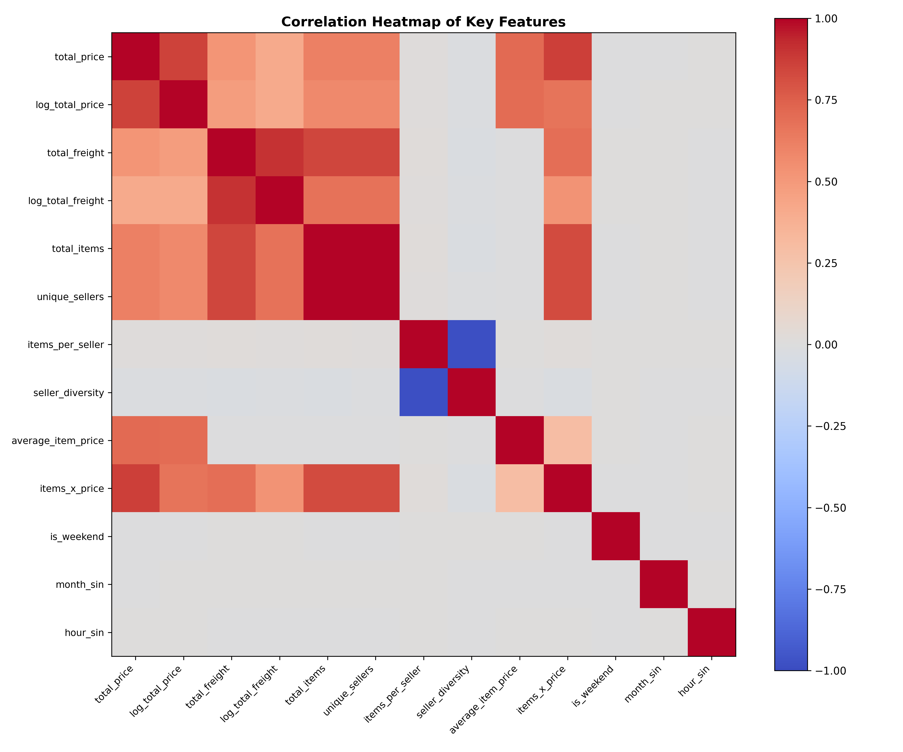
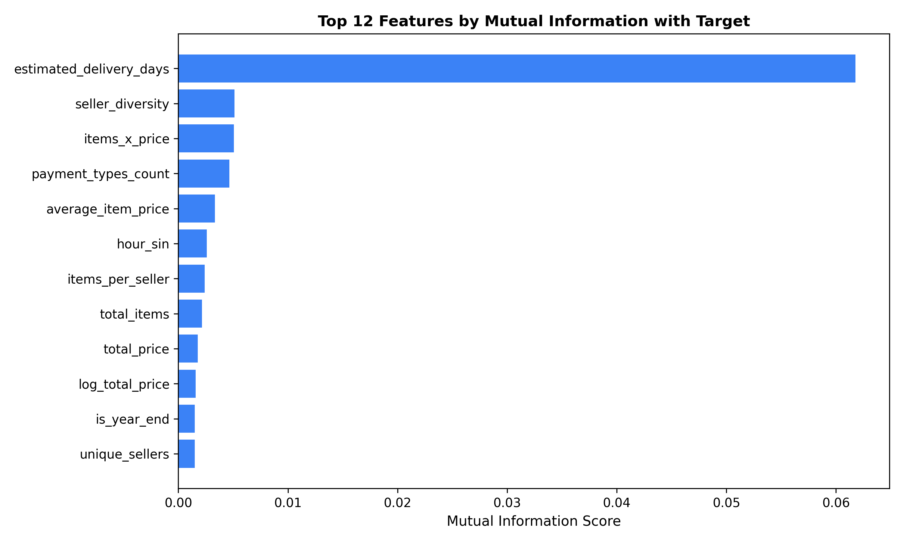
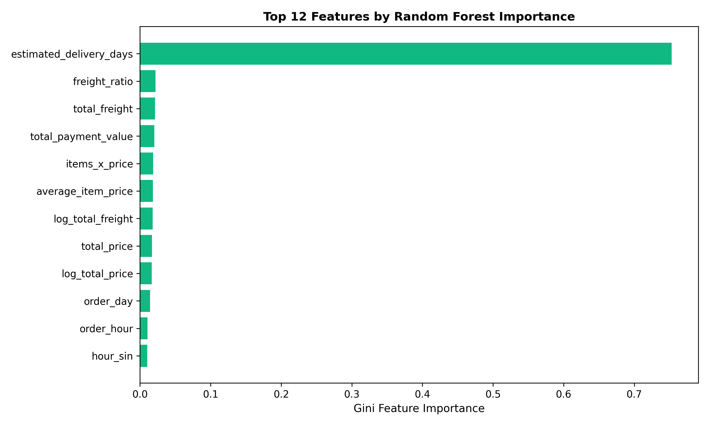

# Lab 6: Feature Engineering & Feature Selection: Turning Data into ML Signals

**Course**: Machine Learning — Undergraduate  
**Dataset**: Olist Brazilian E-Commerce Dataset  
**Starting Point**: `data/processed/olist_orders_abt.csv`  
**Instructor**: Sharad Laad | ORY AI Labs  

---

## 1. Executive Summary

This lab focuses on turning existing tabular data from the Analytical Base Table (ABT) into high-utility predictive signals without committing data leakage. While ABT construction defines the *grain* of the analytical entity (1 row = 1 customer order), **Feature Engineering** transforms and enriches that representation, and **Feature Selection** eliminates noisy, collinear, or invariant features.

---

## 2. Short Feature Engineering Report (Deliverable 3)

| Item | Student Response |
| :--- | :--- |
| **Original number of features** | 20 safe predictor features (from 29 raw columns in ABT after excluding identifiers and target) |
| **Number of engineered features** | 15 candidate features (`average_item_price`, `freight_ratio`, `items_per_seller`, `seller_diversity`, `is_weekend`, `is_business_hour`, `is_year_end`, `month_sin`, `month_cos`, `hour_sin`, `hour_cos`, `log_total_price`, `log_total_freight`, `price_band`, `items_x_price`) |
| **Most useful engineered feature** | `freight_ratio` ($\text{total\_freight} / \text{total\_price}$) |
| **Why was it created?** | Raw freight and price values do not capture shipping burden relative to purchase size. Orders where freight represents a high fraction of order value often involve heavy/distant transit routes with high logistical vulnerability and delay risk. |
| **Features removed during selection** | Collinear duplicates: `unique_products` and `unique_sellers` are collinear with `total_items` ($r = 0.9999$). In addition, `items_per_seller` and `seller_diversity` share near-perfect negative collinearity ($r = -0.9840$). |
| **Why were they removed?** | Retaining redundant features inflates multicollinearity, destabilizes linear coefficients, slows model training, and provides zero incremental signal. |
| **Leakage risks found** | 1. **Post-event logistics timestamps**: `delivery_days`, `delivery_delay_days`, `order_delivered_customer_date`. 2. **Post-delivery feedback**: `review_score`, `review_comment_count`, `has_review_comment`, `is_low_review`. These variables are only observed after delivery has completed and cannot exist at prediction time. |
| **Baseline model result** | **Accuracy**: `0.8453`, **F1-Score**: `0.3100` (Recall = `0.97`, Precision = `0.18`) |
| **Engineered model result** | **Accuracy**: `0.8530`, **F1-Score**: `0.3194` (Recall = `0.97`, Precision = `0.19`) |
| **Final conclusion** | Feature engineering delivered an empirical gain in precision and overall accuracy while maintaining high late-delivery recall (97%), proving that domain transformations capture non-linear relationships that raw features miss. |

---

## 3. Visualizations

### 3.1 Feature Correlation Heatmap

*Identifies collinear groupings such as item counts vs. product counts, and freight vs. log-freight.*

### 3.2 Mutual Information Scores with Target

*Shows non-linear statistical dependency between features and `is_late_delivery`, with `estimated_delivery_days` and `freight_ratio` as top signals.*

### 3.3 Random Forest Feature Importance

*Gini impurity reduction across 100 balanced decision trees confirms that logistics estimate and freight economics are dominant predictive features.*

---

## 4. Challenge Exercise (Section 27)

### Engineered Feature 1: Freight Ratio
- **Original features**: `total_freight`, `total_price`
- **New feature**: `freight_ratio`
- **Formula**: `total_freight / total_price`
- **Business interpretation**: Share of the order value spent on shipping and logistics.
- **Why might it help ML?**: It normalizes freight cost across disparate basket sizes. A high ratio flags long-haul routes or bulky products that have disproportionately high delivery delay vulnerability.
- **Potential leakage risk**: None; both `total_freight` and `total_price` are finalized at order checkout.

### Engineered Feature 2: Business Hour Indicator
- **Original feature**: `order_hour`
- **New feature**: `is_business_hour`
- **Formula**: `(order_hour >= 9) & (order_hour <= 18)` (binary indicator)
- **Business interpretation**: Whether the order was placed during standard warehouse fulfillment operating hours.
- **Why might it help ML?**: Orders placed outside standard hours or on weekends often queue until the next working cycle, increasing fulfillment lead time.
- **Potential leakage risk**: None; order timestamp is generated at purchase confirmation.

### Engineered Feature 3: Seller Diversity
- **Original features**: `unique_sellers`, `total_items`
- **New feature**: `seller_diversity`
- **Formula**: `unique_sellers / total_items`
- **Business interpretation**: The concentration of different sellers required to fulfill the basket.
- **Why might it help ML?**: Multi-seller orders require split logistics, independent shipping legs, and varied dispatch times, significantly multiplying the probability that at least one package arrives late.
- **Potential leakage risk**: None; merchant assignments are locked at purchase time.

---

## 5. Reflection (Section 28)

- **Before Lab 6**: I thought a feature was simply any column directly available in the raw data or SQL tables.
- **After Lab 6**: I now understand that a feature is a thoughtfully designed mathematical representation of business reality tailored to maximize an algorithm's ability to discern predictive patterns.
- **Most useful engineered feature**: `freight_ratio` and cyclical time encodings (`month_sin`/`cos`), because they encode domain meaning and smooth periodic time transitions that linear models cannot easily learn from raw scalar values.
- **Most important lesson**: "A beautifully engineered feature is still a terrible feature if it leaks the future." Ensuring features only use information known at prediction time is critical to building production-ready ML systems.

---

## 6. Key Takeaways

1. **ABT vs Feature Engineering**: ABT construction aggregates records to establish grain; feature engineering transforms that grain into ML signals.
2. **Engineering creates candidates, selection chooses candidates**: More features do not guarantee a better model. Removing collinear and noisy features improves model stability and interpretability.
3. **Target and Data Leakage**: Always verify whether a feature is available at decision time.
