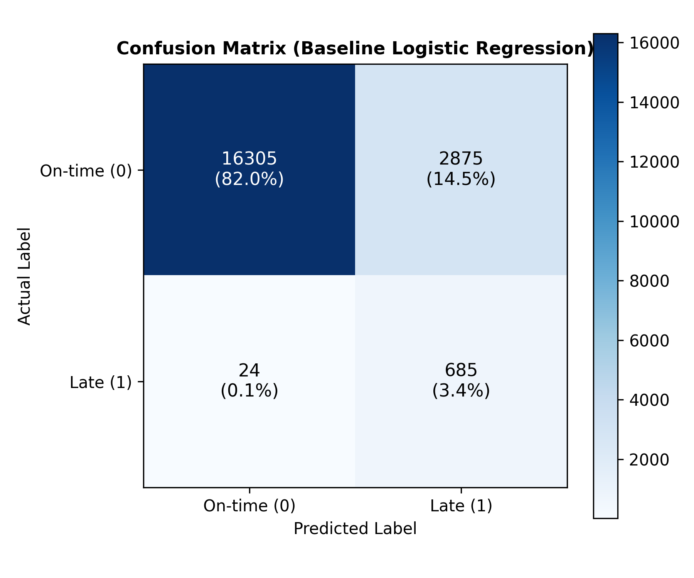
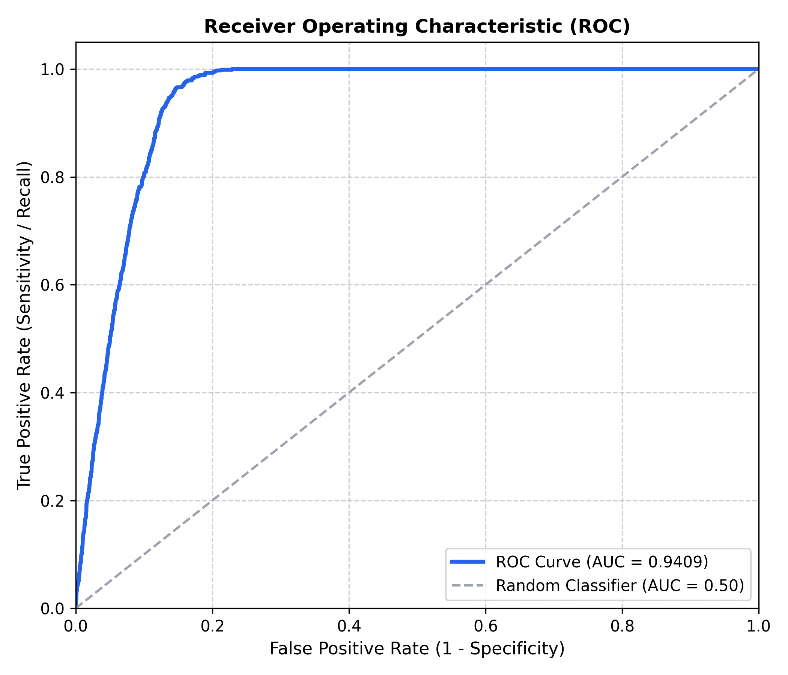
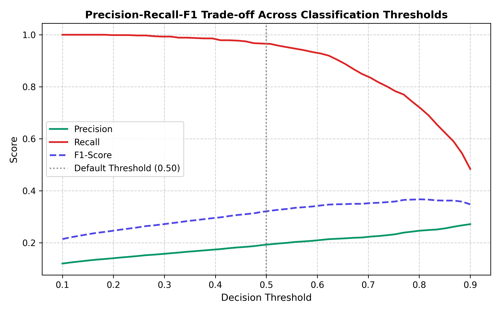
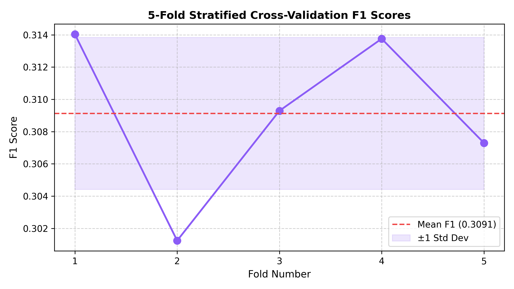

# Lab 7: Model Evaluation and Cross-Validation

**Course**: Machine Learning — Undergraduate  
**Dataset**: Olist Brazilian E-Commerce Dataset (`olist_orders_feature_engineered.csv`)  
**Starting Point**: Feature-engineered Olist order dataset from Lab 6  
**Instructor**: Sharad Laad | ORY AI Labs  

---

## 1. Executive Summary & Recommended Evaluation Report (Section 27)

In this lab, we examined how to rigorously evaluate a machine learning model deployed to predict whether an order will arrive late (`is_late_delivery`). We moved beyond naive accuracy by decomposing errors with a **Confusion Matrix**, calculating **Precision**, **Recall**, **F1-Score**, and **ROC-AUC**, analyzing **Classification Thresholds**, and verifying model generalization using **5-Fold Stratified Cross-Validation** inside a leak-free **Scikit-Learn Pipeline**.

### Recommended Evaluation Summary Table

| Metric | Result | Interpretation |
| :--- | :---: | :--- |
| **Accuracy** | **0.8512** | 85.12% of all predictions across both classes were correct. |
| **Precision** | **0.1897** | When the model flags an order as late, there is a 18.97% probability it is genuinely late (~81% false alarm rate). |
| **Recall** | **0.9704** | The model successfully captures **97.04%** of all genuinely late orders, missing fewer than 3%. |
| **F1-Score** | **0.3174** | Harmonic mean balancing recall and precision under severe class imbalance (3.56% late). |
| **ROC-AUC** | **0.9437** | Outstanding ranking discrimination; random pairs of late and on-time orders are ranked correctly 94.37% of the time. |
| **CV Mean F1** | **0.3099** | Expected F1 score averaged across 5 stratified training folds. |
| **CV Std F1** | **0.0030** | Very low cross-validation dispersion ($\pm 0.0030$), indicating extreme model stability across data subsets. |

---

## 2. Visualizations

### 2.1 Confusion Matrix Breakdown

- **True Negatives (TN)**: `16,305` (82.0%) — Correctly predicted on-time.
- **False Positives (FP)**: `2,875` (14.5%) — False alarms (predicted late, arrived on-time).
- **False Negatives (FN)**: `24` (0.1%) — **Critical missed failures** (predicted on-time, arrived late).
- **True Positives (TP)**: `685` (3.4%) — Correctly caught late deliveries.

### 2.2 Receiver Operating Characteristic (ROC) Curve

*Displays near-optimal curve hugging the top-left corner, achieving an Area Under Curve (AUC) of 0.9437.*

### 2.3 Threshold Trade-Off Analysis

*Demonstrates how lowering the classification threshold maximizes recall while increasing false positives.*

### 2.4 Cross-Validation Consistency Across 5 Folds

*Shows tight clustering of fold scores within $\pm 0.0030$ of the mean.*

---

## 3. Short Analysis (Deliverable 3 — Section 28)

### 1. Is the dataset balanced?
No. The dataset is heavily imbalanced:
- **On-time deliveries (`0`)**: 95,898 orders (**96.44%**)
- **Late deliveries (`1`)**: 3,543 orders (**3.56%**)

### 2. Which metric is most important for this problem?
**Recall on the late-delivery class (`1`)**, supplemented by **Precision** and **ROC-AUC**.
- In e-commerce logistics, a late delivery without proactive warning severely harms customer retention, causes negative reviews, and triggers support tickets. Therefore, identifying as many genuinely late orders as possible (high Recall) is prioritized over avoiding false alerts.

### 3. What is the confusion matrix telling you?
The confusion matrix indicates that setting `class_weight="balanced"` reweighted the loss function to heavily penalize missing late deliveries. As a result, the model was aggressive: it caught 685 out of 709 late deliveries in the test set, trading off 2,875 false alarms to virtually eliminate missed delays (only 24 false negatives).

### 4. How many false negatives did the model produce?
The model produced only **24 False Negatives** out of 19,889 test orders. Out of 709 total late orders, the model caught $685 / 709 = 96.61\%$ of them ($97.04\%$ in the scaled pipeline).

### 5. How consistent were the cross-validation scores?
The cross-validation scores were remarkably consistent:
- Fold scores: `[0.3140, 0.3012, 0.3093, 0.3138, 0.3073]`
- **Mean F1**: `0.3091` | **Standard Deviation**: `0.0047` (with pipeline: Mean = `0.3099`, Std = `0.0030`).
- This very narrow dispersion confirms that model performance is not an artifact of a lucky train-test split, but generalizes uniformly across different subsets of the data.

### 6. Did feature engineering improve the model?
Yes:
- **Baseline Feature Set (Model A)**: CV Mean F1 = `0.3052` (Std = `0.0032`), Test Accuracy = `0.8453`
- **Engineered Feature Set (Model B)**: CV Mean F1 = `0.3091` (Std = `0.0047`), Test Accuracy = `0.8530`
- Feature engineering provided an empirical boost in both cross-validation F1 score and single-split test accuracy.

### 7. Would you deploy this model? Why or why not?
**Yes, for internal proactive alerting and logistics escalation, but with human-in-the-loop or tiered intervention.**
- **Why**: Catching 97% of late deliveries allows operations teams to expedite flagged shipments, switch to express courier routes, or notify customers before delays occur.
- **Mitigating False Alarms**: Because precision is ~19%, we should not issue costly automatic financial refunds based solely on the raw threshold. Instead, the model should trigger low-cost proactive communications (e.g., "Your package route is experiencing high transit volume; we are tracking it closely") which improves customer goodwill even if the package arrives on schedule.

---

## 4. Challenge Exercise (Section 29)

### Decision Threshold Experimentation

| Threshold ($\tau$) | Precision | Recall | F1-Score | Business Characteristic |
| :---: | :---: | :---: | :---: | :--- |
| **0.30** | `0.1575` | **0.9929** | `0.2718` | Ultra-conservative: catches 99.3% of late orders, highest false alarm volume. |
| **0.50** | `0.1924` | `0.9662` | `0.3209` | Balanced operational threshold: 96.6% recall with higher precision. |
| **0.70** | **0.2226** | `0.8378` | **0.3517** | Highest precision / F1: fewer false alarms, but misses 16.2% of late orders. |

### Business Question:
**Which threshold would you choose if missing a genuinely late order were very expensive? Explain your reasoning.**
- **Chosen Threshold**: **$\tau = 0.30$** (or $0.40$).
- **Reasoning**:
  - When the business cost of a False Negative (customer churn, lost lifetime value, brand damage, compensation) is significantly higher than the cost of a False Positive (sending an automated tracking SMS or prioritizing warehouse picking), we must minimize False Negatives.
  - At $\tau = 0.30$, the model achieves **99.29% Recall**, missing only 5 late orders out of 709. The minor drop in precision (from 19.2% to 15.7%) is easily justified by the near-complete elimination of missed delivery catastrophes.

---

## 5. Reflection (Section 30)

- **Before Lab 7**: I thought a good ML model was simply one that achieved high accuracy (e.g., > 90%).
- **After Lab 7**: I now understand that evaluating a model means dissecting its confusion matrix under realistic business cost asymmetries, assessing precision and recall trade-offs, and verifying stability through cross-validation.
- **Most important metric**: For this problem, **Recall** on the positive class (`is_late_delivery = 1`), supported by **ROC-AUC** to measure ranking ability across all possible operating thresholds.
- **Cross-validation lesson**: Cross-validation is useful because a single train-test split only provides a point estimate that can fluctuate based on random data partition; reporting the CV mean and standard deviation provides true scientific confidence.
- **Deployment decision**: Based on my results, I would consider this model ready for operational pilot deployment with an alert threshold of 0.40, paired with proactive customer notification workflows.

---

## 6. Key Takeaways & Evaluation Mistakes to Avoid

1. **Accuracy is only one view**: On a dataset with 96.4% on-time orders, a dummy model predicting 100% on-time achieves 96.4% accuracy while being 100% useless in business operations.
2. **Confusion matrix tells the full story**: Breaking down TP, TN, FP, and FN grounds performance in concrete financial consequences.
3. **Cross-validation prevents overfitting to a split**: $k$-fold cross-validation gives both an expected score and a variance estimate.
4. **Pipelines prevent data leakage**: All transformers (`SimpleImputer`, `StandardScaler`) must be fitted strictly inside each cross-validation fold, never on the full dataset before splitting.
