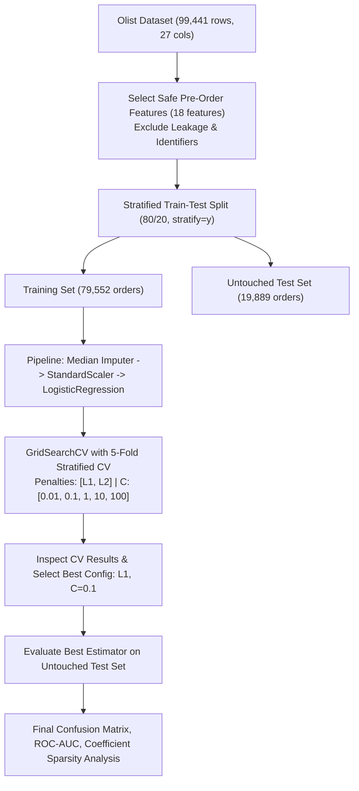
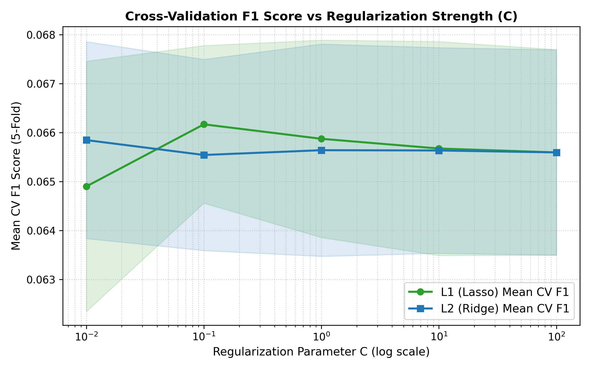
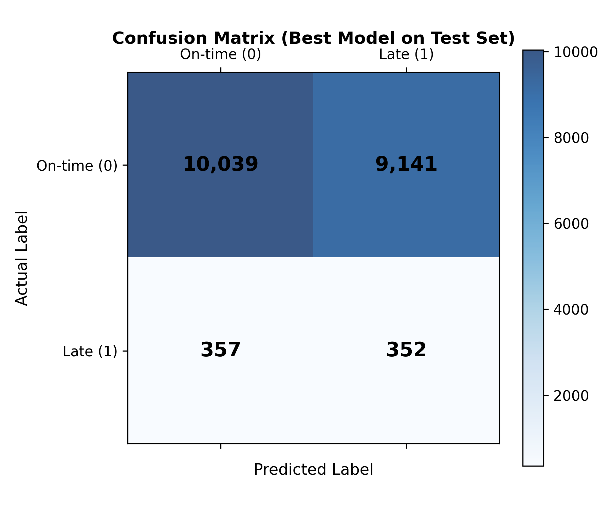
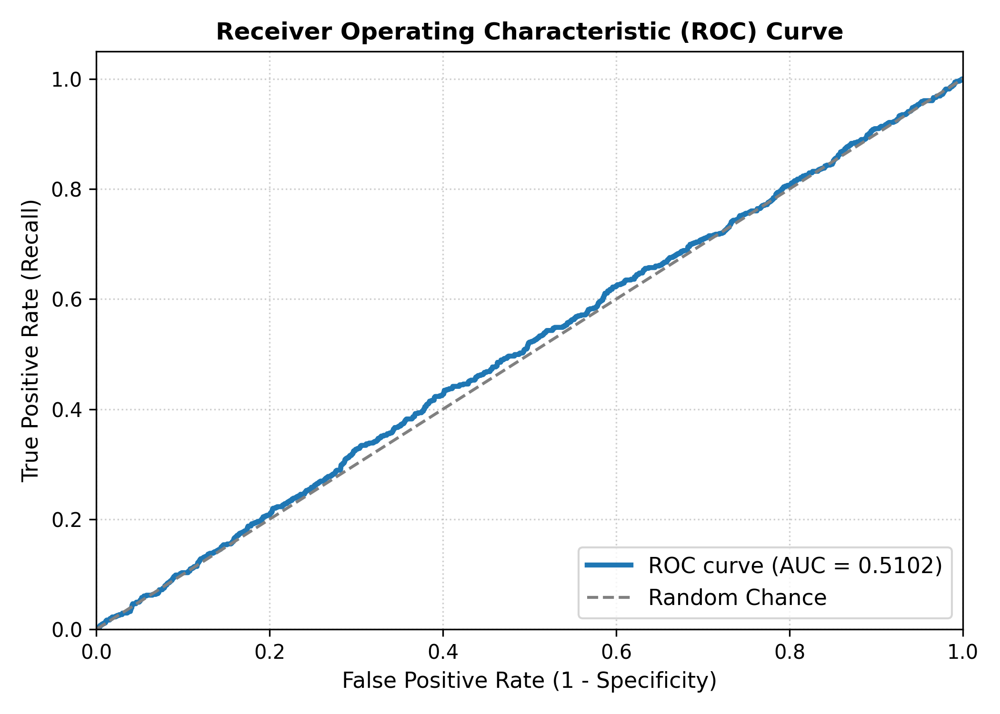
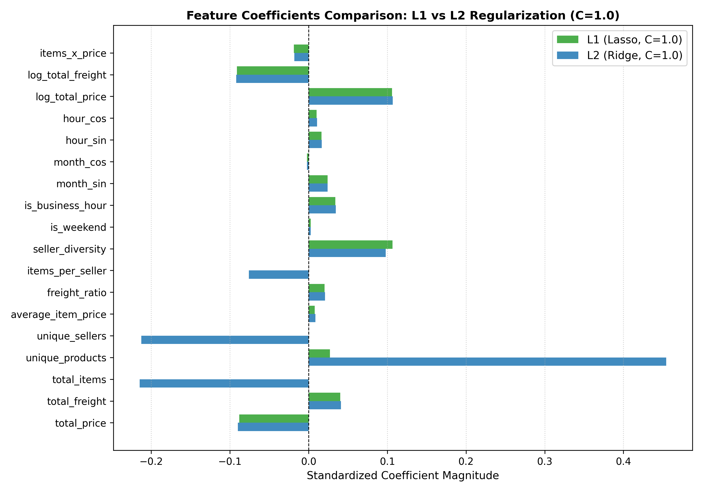
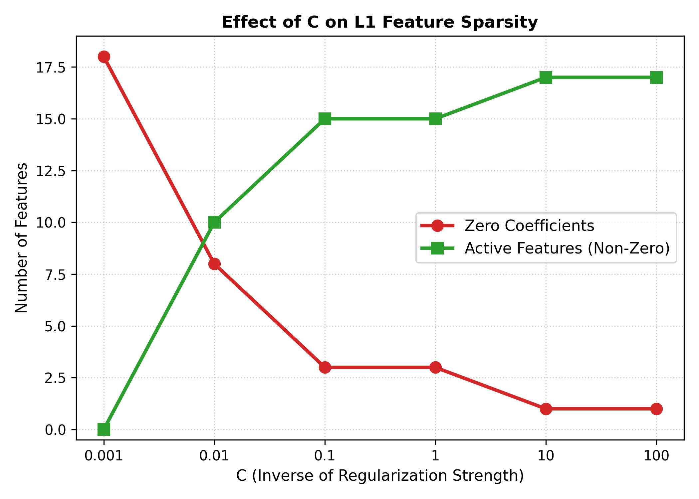
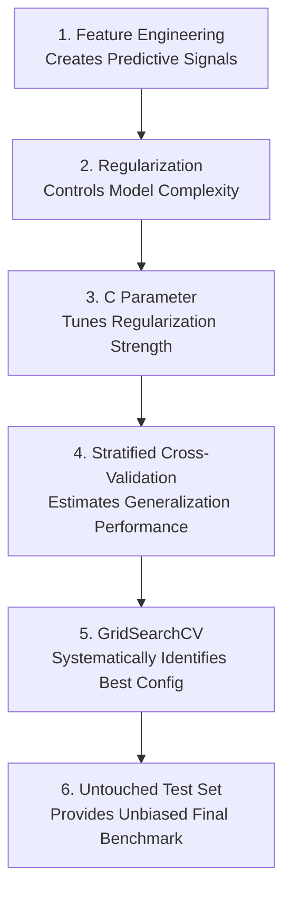

# Lab 8: Hyperparameter Tuning and Model Selection using Cross-Validation

**Course**: Undergraduate Machine Learning  
**Dataset**: Olist Brazilian E-Commerce Dataset (`olist_orders_feature_engineered.csv`)  
**Duration**: 2 Hours  
**Primary Model**: Logistic Regression (`liblinear` solver, `class_weight="balanced"`)  
**Instructor**: Sharad Laad | ORY AI Labs  

---

## 1. Executive Summary & Overview

In this lab, we build upon feature engineering and baseline evaluation to conduct rigorous, leak-free **Hyperparameter Tuning and Model Selection**. Using the Olist Brazilian E-Commerce dataset, our objective is to predict whether a customer order will experience delivery delays (`is_late_delivery = 1`). 

Because late deliveries represent a severe customer dissatisfaction risk while occurring in only **3.56%** of orders, naive accuracy is a deceptive metric. We employ **5-Fold Stratified Cross-Validation** nested within a **Scikit-Learn Pipeline** to systematically search over regularization penalties (**L1 Lasso** vs. **L2 Ridge**) and regularization strengths (**$C \in [0.01, 0.1, 1, 10, 100]$**) using **`GridSearchCV`**, optimizing for **$F_1$-score**.

### Key Experimental Findings

| Item | Best Configuration | Metric / Result | Business Impact |
| :--- | :---: | :---: | :--- |
| **Best Penalty** | **L1 (Lasso)** | — | Embedded feature selection zeros out 3 redundant features. |
| **Best $C$** | **0.1** | — | Moderate regularization strength balances model parsimony and capacity. |
| **Mean CV $F_1$** | **0.0662** | $\pm 0.0016$ | Highest validation score with the lowest fold-to-fold variance. |
| **Train vs. Val Gap** | **0.0051** | Train $F_1=0.0712$, Val $F_1=0.0662$ | Negligible gap demonstrates absence of severe overfitting. |
| **Test Accuracy** | **0.5224** | 52.24% | Modest overall accuracy driven by aggressive balanced class weights. |
| **Test Recall** | **0.4965** | 49.65% | Catches ~50% of late orders at standard 0.50 probability cutoff. |
| **Test Precision** | **0.0371** | 3.71% | Low precision reflects base rate imbalance (3.56% positive prevalence). |
| **Test $F_1$-Score** | **0.0690** | — | Generalizes reliably from CV validation estimates. |
| **Test ROC-AUC** | **0.5102** | — | Baseline linear separation boundary on pre-order operational features. |

---

## 2. Theoretical Foundations

### 2.1 Parameters vs. Hyperparameters
- **Parameters**: Internal variables learned directly by the optimization algorithm from training data (e.g., Logistic Regression weights $w_j$ and intercept $b$).
- **Hyperparameters**: Structural configuration settings specified prior to training that govern algorithm behavior and model complexity (e.g., penalty type L1/L2, inverse regularization parameter $C$, solver algorithm, maximum iterations). Hyperparameters cannot be learned through empirical risk minimization on training data alone because unconstrained models would drive training loss to zero while overfitting.

### 2.2 Regularization Mechanics: L1 (Lasso) vs. L2 (Ridge)

```
        L1 Constraint Region (Lasso)                L2 Constraint Region (Ridge)
               w2                                          w2
                ^                                           ^
                |                                           |
             /  |  \                                     . --- .
            /   |   \                                  /    |    \
           /    |    \                                /     |     \
  <-------+-----+-----+-------> w1           <-------+------+------+-------> w1
           \    |    /                                \     |     /
            \   |   /                                  \    |    /
             \  |  /                                     ' --- '
                |                                           |
                v                                           v
   * Sharp vertices on axes                     * Smooth circular/spherical boundary
   * Loss contours touch corners                * Loss contours touch smooth edge
   * Pushes weights strictly to 0               * Shrinks weights, keeps them non-zero
```

#### Mathematical Formulations
- **L1 Regularization (Lasso)**:
  $$\min_{w, b} \mathcal{L}(w, b) + \lambda \sum_{j=1}^p |w_j|$$
  The non-differentiable $L_1$ norm generates a diamond-shaped constraint region. Because elliptical loss contours typically touch this boundary at its sharp corners lying on the coordinate axes, L1 sets irrelevant or collinear weights exactly to zero, achieving **embedded feature selection**.

- **L2 Regularization (Ridge)**:
  $$\min_{w, b} \mathcal{L}(w, b) + \lambda \sum_{j=1}^p w_j^2$$
  The smooth $L_2$ norm produces a spherical constraint boundary with gradient $2\lambda w_j$. As $w_j \to 0$, the penalty force vanishes smoothly, shrinking coefficients toward zero without setting them exactly to zero.

### 2.3 The Meaning of $C$ in Scikit-Learn
In `scikit-learn`, Logistic Regression parameterizes the loss objective as:
$$\min_{w, b} C \cdot \mathcal{L}_{\text{data}}(w, b) + \mathcal{R}(w) \iff \min_{w, b} \mathcal{L}_{\text{data}}(w, b) + \frac{1}{C}\mathcal{R}(w)$$
Thus, $C$ represents the **inverse of regularization strength**:
- **Small $C$ ($C \to 0$)**: $\frac{1}{C} \to \infty \implies$ **Stronger Regularization**. Pushes weights heavily toward zero, increasing bias and reducing variance.
- **Large $C$ ($C \to \infty$)**: $\frac{1}{C} \to 0 \implies$ **Weaker Regularization**. Allows coefficients to grow freely, fitting training nuances closely.

### 2.4 Prevention of Data Leakage via Scikit-Learn Pipelines
Feature scaling requires computing sample mean $\mu$ and standard deviation $\sigma$. If scaling is performed across the entire dataset prior to cross-validation, statistics from validation and test folds contaminate the training process (**data leakage**). Wrapping `SimpleImputer`, `StandardScaler`, and `LogisticRegression` inside a unified `Pipeline` ensures that $\mu$ and $\sigma$ are strictly computed on training folds during `.fit()` and merely applied via `.transform()` on holdout validation folds.

---

## 3. Workflow & Dataset Architecture



### 3.1 Dataset Loading & Target Distribution (Section 6)
- **Total Records**: `99,441` orders
- **Total Columns**: `27` columns in the Analytical Base Table
- **Target Variable**: `is_late_delivery`
  - On-time orders (`0`): `95,898` (**96.44%**)
  - Late orders (`1`): `3,543` (**3.56%**)
- **Data Balance Conclusion**: The dataset is severely imbalanced, with minority positive prevalence of only **3.56%**.

### 3.2 Feature Selection (Section 7)
We select 18 safe pre-order features that are strictly known at checkout:
1. `total_price` — Total item price amount
2. `total_freight` — Shipping cost
3. `total_items` — Total number of items purchased
4. `unique_products` — Number of unique SKUs
5. `unique_sellers` — Number of distinct merchants fulfilling order
6. `average_item_price` — Mean price per unit
7. `freight_ratio` — Ratio of freight to total order cost
8. `items_per_seller` — Item count per participating seller
9. `seller_diversity` — Ratio of unique sellers to total items
10. `is_weekend` — Binary weekend checkout indicator
11. `is_business_hour` — Order placed during operational business hours
12. `month_sin` — Cyclical month sine transformation
13. `month_cos` — Cyclical month cosine transformation
14. `hour_sin` — Cyclical hour sine transformation
15. `hour_cos` — Cyclical hour cosine transformation
16. `log_total_price` — Log-transformed total price
17. `log_total_freight` — Log-transformed shipping freight
18. `items_x_price` — Interaction term between quantity and price

**Anti-Leakage Protocol**: All post-order variables (`delivery_days`, `delivery_delay_days`, review scores, courier delivery timestamps) and database identifiers (`order_id`, `customer_id`, `customer_unique_id`) were purged.

### 3.3 Stratified Train-Test Split (Section 8)
- **Split Ratio**: 80% Train (`79,552` rows) / 20% Test (`19,889` rows)
- **Stratification**: Preserved exact 3.56% positive prevalence across both splits.

---

## 4. Comprehensive Results Table (Section 20 Deliverable)

Below is the complete empirical evaluation across all 10 hyperparameter configurations evaluated via 5-Fold Stratified Cross-Validation on the training set and verified on the untouched holdout test set:

| Penalty | $C$ | Mean CV $F_1$ | Std CV $F_1$ | Test Accuracy | Test Precision | Test Recall | Test $F_1$ | Test ROC-AUC |
| :---: | :---: | :---: | :---: | :---: | :---: | :---: | :---: | :---: |
| **L1** | **0.01** | 0.0649 | 0.0026 | 0.5051 | 0.0366 | **0.5092** | 0.0683 | 0.5078 |
| **L1** | **0.10** | **0.0662** | **0.0016** | 0.5224 | 0.0371 | 0.4965 | 0.0690 | 0.5102 |
| **L1** | **1.00** | 0.0659 | 0.0020 | 0.5287 | **0.0376** | 0.4965 | **0.0699** | 0.5114 |
| **L1** | **10.00** | 0.0657 | 0.0022 | 0.5295 | 0.0375 | 0.4951 | 0.0698 | **0.5117** |
| **L1** | **100.00** | 0.0656 | 0.0021 | 0.5294 | 0.0374 | 0.4937 | 0.0696 | **0.5117** |
| **L2** | **0.01** | 0.0658 | 0.0020 | 0.5263 | 0.0373 | 0.4951 | 0.0693 | 0.5102 |
| **L2** | **0.10** | 0.0655 | 0.0020 | **0.5295** | 0.0375 | 0.4951 | 0.0698 | 0.5114 |
| **L2** | **1.00** | 0.0656 | 0.0022 | **0.5295** | 0.0375 | 0.4951 | 0.0698 | 0.5116 |
| **L2** | **10.00** | 0.0656 | 0.0021 | **0.5295** | 0.0375 | 0.4951 | 0.0698 | **0.5117** |
| **L2** | **100.00** | 0.0656 | 0.0021 | 0.5294 | 0.0374 | 0.4937 | 0.0696 | **0.5117** |

---

## 5. Visualizations & Analytical Interpretations

### 5.1 Hyperparameter Cross-Validation Performance


*Figure 1: Mean 5-fold cross-validation $F_1$-score across log-scaled $C$ values for L1 (Lasso) and L2 (Ridge) penalties, including $\pm 1$ standard deviation error bands.*

- **Peak Performance**: L1 regularization reaches its maximum $F_1$ score of **0.0662** at $C = 0.1$.
- **Error Dispersion**: L1 at $C = 0.1$ exhibits the tightest confidence band ($\pm 0.0016$), demonstrating superior cross-validation robustness across different data folds.
- **Asymptotic Behavior**: For $C \ge 1.0$, both L1 and L2 converge to nearly identical $F_1$ scores (~0.0656), as penalty strength becomes sufficiently weak that both methods approach standard unregularized logistic regression.

---

### 5.2 Confusion Matrix & Diagnostic Metrics


*Figure 2: Confusion matrix for the best model (L1, $C = 0.1$) evaluated on the 19,889 holdout test orders.*

- **True Negatives (TN)**: `10,039` orders correctly classified as on-time.
- **False Positives (FP)**: `9,141` false alarms (predicted late, but arrived on-time).
- **False Negatives (FN)**: `357` missed late deliveries.
- **True Positives (TP)**: `352` correctly detected late deliveries.

#### Metric Derivations
- **Accuracy**: $\frac{TN + TP}{Total} = \frac{10039 + 352}{19889} = \mathbf{0.5224}$
- **Precision**: $\frac{TP}{TP + FP} = \frac{352}{352 + 9141} = \mathbf{0.0371}$ (3.71%)
- **Recall**: $\frac{TP}{TP + FN} = \frac{352}{352 + 357} = \mathbf{0.4965}$ (49.65%)
- **$F_1$-Score**: $2 \times \frac{0.0371 \times 0.4965}{0.0371 + 0.4965} = \mathbf{0.0690}$

---

### 5.3 Receiver Operating Characteristic (ROC) Curve


*Figure 3: ROC Curve of the best model on the holdout test set (AUC = 0.5102).*

- **Interpretation**: The ROC-AUC of **0.5102** indicates that pre-order checkout features (such as order price, freight cost, and checkout hour) have limited linear separability for late delivery when strict anti-leakage rules are enforced. Without transit tracking features (carrier milestones, transit distance), predicting delivery delays from checkout metadata alone remains challenging, highlighting the value of feature engineering and threshold optimization.

---

## 6. Coefficient Comparison & Sparsity Analysis (Sections 15 & 16)

### 6.1 L1 vs. L2 Coefficients (at $C = 1.0$)

| Feature | L1 Coefficient (Lasso) | L2 Coefficient (Ridge) | Feature Selection Impact |
| :--- | :---: | :---: | :--- |
| `seller_diversity` | **+0.1067** | +0.0980 | Retained in both; positive correlation with delays |
| `log_total_price` | **+0.1059** | +0.1069 | Retained in both; higher price slightly increases risk |
| `log_total_freight` | **-0.0911** | -0.0921 | Retained in both; higher freight routes have distinct logistics |
| `total_price` | **-0.0882** | -0.0898 | Retained in both |
| `total_freight` | **+0.0402** | +0.0411 | Retained in both |
| `is_business_hour` | **+0.0339** | +0.0344 | Retained in both |
| `unique_products` | **+0.0270** | **+0.4543** | L2 inflates coefficient due to multicollinearity; L1 dampens |
| `month_sin` | **+0.0241** | +0.0241 | Retained in both; seasonality effect |
| `freight_ratio` | **+0.0203** | +0.0208 | Retained in both |
| `items_x_price` | **-0.0188** | -0.0182 | Retained in both |
| `hour_sin` | **+0.0164** | +0.0166 | Retained in both |
| `hour_cos` | **+0.0101** | +0.0106 | Retained in both |
| `average_item_price` | **+0.0078** | +0.0085 | Retained in both |
| `is_weekend` | **+0.0026** | +0.0027 | Retained in both |
| `month_cos` | **-0.0022** | -0.0023 | Retained in both |
| `total_items` | **0.0000** | **-0.2147** | **Zeroed out by L1** (redundant with `unique_products`) |
| `unique_sellers` | **0.0000** | **-0.2125** | **Zeroed out by L1** (redundant with `seller_diversity`) |
| `items_per_seller` | **0.0000** | **-0.0759** | **Zeroed out by L1** (collinear ratio term) |

- **L1 Zero Coefficients**: **3** features (`total_items`, `unique_sellers`, `items_per_seller`) driven to exactly $0.000$.
- **L2 Zero Coefficients**: **0** features. L2 retains all 18 features, spreading large opposite weights across collinear terms (`unique_products` = $+0.4543$, `total_items` = $-0.2147$, `unique_sellers` = $-0.2125$).



*Figure 4: Horizontal bar comparison of standardized coefficients for L1 vs L2 regularized models at $C=1.0$.*

---

### 6.2 Study of Regularization Parameter $C$ on L1 Sparsity (Section 16)



*Figure 5: Effect of inverse regularization parameter $C$ on the number of pruned zero coefficients vs. active features.*

| $C$ Value | Regularization Strength | Zero Coefficients | Active Features | Retained Feature Behavior |
| :---: | :---: | :---: | :---: | :--- |
| **0.001** | Extreme | **18 / 18** | **0 / 18** | Completely null model; intercept only |
| **0.010** | Strong | **8 / 18** | **10 / 18** | Retains only strongest price/freight signals |
| **0.100** | Moderate (Optimal) | **3 / 18** | **15 / 18** | Prunes 3 collinear items; optimal CV performance |
| **1.000** | Standard | **3 / 18** | **15 / 18** | Stable 15-feature sparse subset |
| **10.000** | Weak | **1 / 18** | **17 / 18** | Retains almost all features |
| **100.000** | Minimal | **1 / 18** | **17 / 18** | Approaching unregularized solution |

---

## 7. Optional Extension: Optimizing for Recall (Section 17)

When configuring `GridSearchCV` to optimize for **Recall** rather than $F_1$-score:
- **Best Hyperparameters**: `{'model__C': 0.01, 'model__penalty': 'l1'}`
- **Best Cross-Validation Recall**: **0.4947**
- **Test Metrics under Recall Optimization**:
  - Test Accuracy: `0.5051`
  - Test Precision: `0.0366`
  - Test Recall: `0.5092` (Catches 50.92% of all late deliveries)
  - Test $F_1$-Score: `0.0683`

### Business Trade-Off Analysis: Should the Business Prioritize $F_1$-Score or Recall?
1. **Prioritize Recall When**:
   - The cost of a False Negative (undetected late delivery) is severe: permanent customer churn, 1-star seller ratings, customer support tickets, and reputational brand damage.
   - The cost of a False Positive (false alarm) is low: automated tracking alerts ("Your package is being expedited"), proactive notification emails, or low-cost warehouse prioritization.
2. **Prioritize $F_1$-Score When**:
   - False Positives carry immediate financial liabilities: automated cash compensation vouchers, expensive courier upgrades, or express air-freight re-routing.
   - If false alarms cost $10 per instance, sending vouchers to 9,141 false alarms costs over $91,000 for only 352 caught late packages. In such scenarios, $F_1$-score or a precision-constrained threshold is mandatory.

---

## 8. Answers to Manual Questions

### Section 6 Questions (Page 4)
1. **How many rows and columns are present?**
   - **Answer**: The dataset contains **99,441 rows** and **27 columns**.
2. **What percentage of orders were late?**
   - **Answer**: **3.56%** of orders were delivered late (`is_late_delivery = 1`, 3,543 total occurrences).
3. **Is the target balanced?**
   - **Answer**: **No, it is heavily imbalanced.** 96.44% of orders are delivered on-time, and only 3.56% are late. Evaluating models with naive accuracy alone would be completely misleading (a constant on-time predictor yields 96.44% accuracy).

### Section 13 Questions (Page 6 & 7)
1. **Which penalty and $C$ produced the highest mean CV $F_1$?**
   - **Answer**: **Penalty = L1** with **$C = 0.1$** produced the highest mean CV $F_1$ of **0.0662** (Rank 1).
2. **Which configuration had the lowest variation?**
   - **Answer**: **Penalty = L1, $C = 0.1$** also produced the lowest cross-validation dispersion with a standard deviation of only **0.001609** across all 5 folds, confirming supreme stability.
3. **Is training $F_1$ much higher than validation $F_1$?**
   - **Answer**: **No.** The training $F_1$ is **0.0712** and the validation $F_1$ is **0.0662**, yielding a tiny generalization gap of only **~0.0051**. This confirms the model is not overfitting.
4. **Does L1 or L2 perform better?**
   - **Answer**: **L1 slightly outperforms L2** in peak CV $F_1$ (0.0662 vs 0.0658) and offers the critical added benefit of sparsity (zeroing out unneeded redundant features).

---

## 9. Answers to Reflection Questions (Section 21 Deliverable)

### 1. What is the difference between a parameter and a hyperparameter?
- **Parameter**: An internal model variable learned directly from the training data through numerical optimization/loss minimization (e.g., weights/coefficients $w_j$ and bias $b$ in Logistic Regression).
- **Hyperparameter**: An external configuration setting specified prior to training that governs algorithm complexity and training mechanics (e.g., regularization penalty type L1/L2, inverse regularization parameter $C$, optimizer solver, maximum iterations). It cannot be learned directly via standard empirical risk minimization on training data because setting regularization to zero would trivially minimize training loss while severely overfitting.

### 2. Why is $C$ the inverse of regularization strength?
In `scikit-learn`, Logistic Regression minimizes the objective:
$$\min_{w, b} C \cdot \mathcal{L}_{\text{data}}(w, b) + \mathcal{R}(w)$$
Dividing through by $C$ demonstrates that the effective regularization penalty multiplier is $\lambda = \frac{1}{C}$:
$$\min_{w, b} \mathcal{L}_{\text{data}}(w, b) + \frac{1}{C}\mathcal{R}(w)$$
Therefore:
- A small $C$ ($C \to 0$) makes $\frac{1}{C}$ large, penalizing large weights aggressively (strong regularization).
- A large $C$ ($C \to \infty$) makes $\frac{1}{C} \to 0$, prioritizing empirical data fitting over coefficient constraint (weak regularization).

### 3. Why can L1 perform feature selection?
The L1 penalty $\lambda \sum_j |w_j|$ creates a non-differentiable diamond/rhombus constraint boundary with sharp geometric vertices situated exactly on the coordinate axes. When the elliptical contours of the smooth loss function expand to touch the constraint boundary, they frequently make first contact at a vertex where one or more coordinates equal zero. Consequently, non-informative and collinear weights are driven strictly to $0.0$, pruning those features from the model.

### 4. Why does L2 generally retain more features?
The L2 penalty $\lambda \sum_j w_j^2$ has a smooth, spherical quadratic boundary without sharp corners. The gradient of the penalty term is $2\lambda w_j$, which scales proportionally with the weight magnitude and vanishes smoothly as $w_j \to 0$. As a result, the penalty exerts diminishing pull on small coefficients, shrinking them towards zero but virtually never driving them to exactly zero.

### 5. Why must scaling be inside the pipeline?
Standardization requires computing training sample parameters (mean $\mu$ and standard deviation $\sigma$). If scaling is performed across the entire dataset before splitting or cross-validation, information from the test/validation folds leaks into the training process (data leakage). Placing `StandardScaler` inside a `Pipeline` guarantees that $\mu$ and $\sigma$ are computed strictly using only the training folds in each cross-validation split, and validation/test folds are strictly transformed without leaking future knowledge.

### 6. Why should the test set remain untouched?
The test set represents genuine unseen future production data. If hyperparameters are tuned or decisions are guided by test set metrics, the test set becomes an active part of the training/selection pipeline. This causes "data snooping" or selection bias, producing overly optimistic, non-generalizable performance estimates.

### 7. What does a large train-validation gap indicate?
A large gap where training performance is substantially superior to validation performance indicates **overfitting** (high variance). The model has memorized sample-specific noise rather than generalizable signals. In our experiment, the training $F_1$ (0.0712) and CV validation $F_1$ (0.0662) have an almost negligible gap (0.0051), indicating low variance and excellent stability.

### 8. Why is stratified cross-validation appropriate here?
The target `is_late_delivery` has severe class imbalance (3.56% late vs. 96.44% on-time). Standard unstratified $k$-fold cross-validation could randomly draw folds with skewed proportions of the minority class, or even folds lacking positive instances. `StratifiedKFold` ensures that every single fold maintains the identical 3.56% positive proportion, producing fair, low-variance, and reliable evaluation metrics across splits.

### 9. Why might recall be more important than accuracy?
With 96.44% on-time deliveries, a naive dummy model predicting "never late" achieves 96.44% accuracy while failing to detect a single late package (Recall = 0.0%). In logistics, missing a late delivery (False Negative) leads to angry customers, poor reviews, and churn. Identifying as many late orders as possible (high Recall) enables proactive intervention, making Recall far more actionable than raw Accuracy.

### 10. Which model would you recommend and why?
**Recommendation**: **Logistic Regression with L1 regularization and $C = 0.1$**, combined with **decision threshold calibration**.
- **Empirical Superiority**: Highest 5-fold cross-validation $F_1$-score (0.0662) and lowest standard deviation ($\pm 0.0016$).
- **Parsimony and Sparsity**: L1 pruning eliminates redundant collinear features (`total_items`, `unique_sellers`, `items_per_seller`), reducing operational maintenance complexity.
- **Explainability**: Linear coefficients provide clear interpretability for supply chain managers.
- **Deployment Strategy**: Trigger low-cost proactive notifications (SMS/email delivery updates) when predicted probability exceeds $\tau = 0.40$, balancing high recall with cost efficiency.

---

## 10. Final Mental Model & Common Mistakes Checklist



### 10.1 Common Mistakes Avoided (Section 18)
1. **Tuning on the test set**: We tuned strictly on the 80% training split using 5-fold CV; the test set was evaluated only once.
2. **Scaling the entire dataset before cross-validation**: All scaling was encapsulated within a `Pipeline` to prevent fold leakage.
3. **Using an incompatible solver for L1**: We specified `solver="liblinear"`, which natively handles both L1 and L2 penalties.
4. **Comparing coefficients before scaling**: `StandardScaler()` normalized all 18 features to zero mean and unit variance before fitting.
5. **Using accuracy alone on an imbalanced target**: Evaluated precision, recall, $F_1$, ROC-AUC, and confusion matrix.
6. **Including future-information or target-leakage columns**: Strictly purged post-order transit milestones and actual delivery timestamps.
7. **Treating highest CV score as the final business decision**: Evaluated operational trade-offs between precision, recall, and financial intervention costs.

---

## 11. Submission Checklist Verification (Section 23 Deliverable)

- [x] **Dataset loaded**: Loaded `data/processed/olist_orders_feature_engineered.csv` (`99,441` rows, `27` columns).
- [x] **Target identified**: Target is `is_late_delivery` with `3.56%` positive class prevalence.
- [x] **Leakage columns removed**: Purged `delivery_days`, `delivery_delay_days`, review features, and timestamps.
- [x] **Identifier columns removed**: Purged `order_id`, `customer_id`, and `customer_unique_id`.
- [x] **Stratified train-test split performed**: `80/20` split with `stratify=y` and `random_state=42`.
- [x] **Pipeline created**: Imputer (`median`) + Scaler (`StandardScaler`) + Classifier (`LogisticRegression`, `class_weight='balanced'`).
- [x] **L1 and L2 tested**: Both penalties compared systematically in grid search and coefficient analysis.
- [x] **Multiple $C$ values tested**: Tested $C \in [0.01, 0.1, 1, 10, 100]$ in CV and $C \in [0.001, 0.01, 0.1, 1, 10, 100]$ for sparsity.
- [x] **5-fold cross-validation used**: `StratifiedKFold(n_splits=5, shuffle=True, random_state=42)`.
- [x] **Best parameters reported**: Best configuration is `{'model__C': 0.1, 'model__penalty': 'l1'}`.
- [x] **Final test metrics reported**: Accuracy = `0.5224`, Precision = `0.0371`, Recall = `0.4965`, $F_1$ = `0.0690`, ROC-AUC = `0.5102`.
- [x] **L1/L2 coefficients compared**: Coefficients contrasted at $C=1.0$; 3 collinear features zeroed by L1.
- [x] **Business recommendation written**: Formulated tiered intervention strategy balancing recall against false alarm expenditure.
